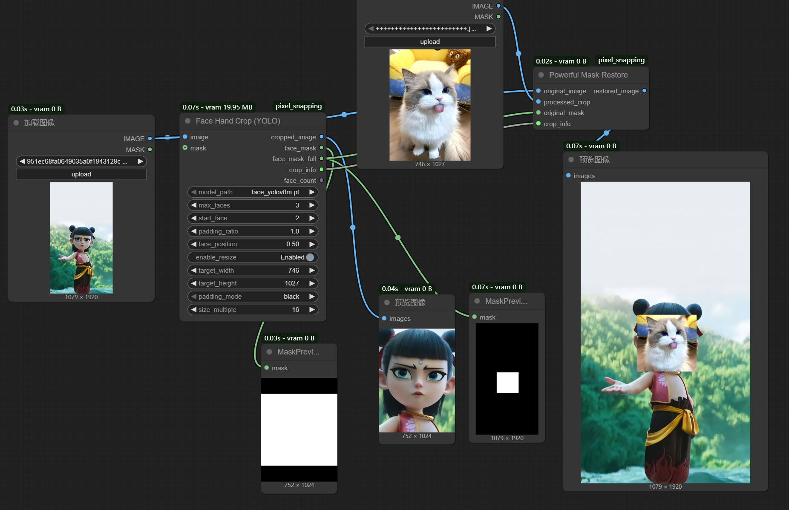
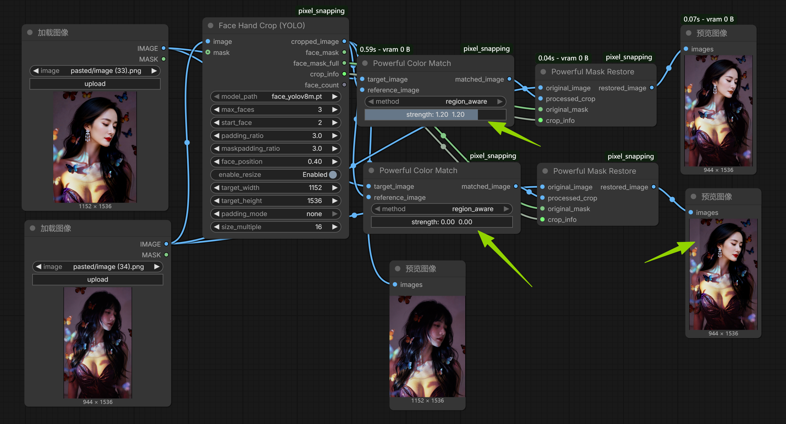

# ComfyUI Pixel Snapping

ComfyUI 自定义节点集，提供基于 SIFT 特征匹配的图像对齐、智能遮罩裁剪和图像恢复功能。

## 功能特性

### 1. Pixel Snapping (SIFT) - 像素级图像对齐
- 使用 SIFT 特征匹配实现精确的图像对齐
- 自动检测并修正非均匀缩放形变
- 支持自定义遮罩控制覆盖区域
- 输出拼接图像、遮罩和修正后的目标图像

### 2. Powerful Mask Crop - 强力遮罩裁剪
- 根据遮罩自动裁剪图像
- 支持自定义 padding 边距（上下左右）
- 可选的尺寸调整功能（缩放到指定宽高）
- 支持宽高比调整和边缘填充（黑色/白色/无填充）
- 输出裁剪图像、裁剪遮罩、裁剪区域遮罩和裁剪信息

### 3. Powerful Mask Restore - 强力遮罩恢复
- 将处理后的裁剪图像恢复到原图相应位置
- 自动处理尺寸缩放和填充剔除
- 支持遮罩精细控制覆盖区域
- 实现无缝图像合成


### 4. Face Hand Crop (YOLO) - 手部/人脸自动裁剪
- 基于 YOLOv8 检测目标并自动裁剪
- 支持可选遮罩输入，用遮罩限制输出的 face_mask/face_mask_full
- 输出裁剪图像、遮罩及裁剪信息，便于后续恢复

### 5. Powerful Color Alignment - 强力颜色对齐
- 基于区域感知的智能颜色对齐，专为换脸/换人场景设计
- 智能阈值检测相同区域（替代固定百分比）
- 饱和度加权调整：灰色区域不影响颜色通道，避免脱色
- 相同区域（背景）强力匹配原图颜色
- 不同区域保留特征并适度调色
- 参数自适应图像尺寸，任意尺寸效果一致
- 四次超大范围平滑，边界自然过渡
- 支持强度调节（0-2.0）

## 安装方法

1. 将本仓库克隆到 ComfyUI 的 `custom_nodes` 目录：
```bash
cd ComfyUI/custom_nodes
git clone https://github.com/flywhale-666/ComfyUI-Pixel_Snapping.git
```

2. 安装依赖：
```bash
cd ComfyUI-Pixel_Snapping
pip install -r requirements.txt
```

3. 重启 ComfyUI

## 使用说明

### 工作流示例

#### 示例 1：特征匹配实现精确的图像对齐


#### 示例 2：遮罩裁剪并放大成指定像素，修改后恢复回帖原图。


#### 示例 3：Face Hand Crop (YOLO) + Restore


#### 示例 4：Powerful Color Alignment - 颜色对齐


### 典型示例

#### 场景 1：图像拼接

1. 使用 `Pixel Snapping (SIFT)` 节点
2. 输入参考图像和待对齐图像
3. 可选：提供目标图像遮罩，控制覆盖区域
4. 输出对齐后的覆盖图像和修正形变后的输入图像。

#### 场景 2：图像局部替换（如换脸）

1. **裁剪阶段**：
   - 使用 `Powerful Mask Crop` 节点
   - 输入原图和人脸遮罩
   - 启用 `enable_resize`，设置目标尺寸为 1024×1024
   - 输出裁剪后的人脸图像和裁剪信息

2. **处理阶段**：
   - 对 1024×1024 的人脸图像进行处理（如使用换脸模型）

3. **恢复阶段**：
   - 使用 `Powerful Mask Restore` 节点
   - 输入原图、处理后的图像、遮罩和裁剪信息
   - 自动将处理后的人脸贴回原图正确位置


### 节点参数说明

#### Powerful Mask Crop

**必需输入**：
- `image`: 原始图像
- `mask`: 遮罩（白色=需要裁剪的区域）

**参数**：
- `top_padding` / `bottom_padding` / `left_padding` / `right_padding`: 裁剪区域的边距（0-10000）
- `enable_resize`: 是否启用尺寸调整
- `target_width` / `target_height`: 目标宽度和高度（0=自动）
- `padding_mode`: 填充模式
  - `none`: 不填充（保持宽高比）
  - `black`: 黑色填充
  - `white`: 白色填充
- `size_multiple`: 尺寸对齐倍数（输出尺寸将是此值的倍数）

**输出**：
- `cropped_image`: 裁剪并缩放后的图像
- `cropped_mask`: 裁剪并缩放后的遮罩
- `crop_region_mask`: 裁剪区域在原图上的矩形遮罩
- `crop_info`: 裁剪信息（用于恢复节点）

#### Powerful Mask Restore

**必需输入**：
- `original_image`: 原始图像
- `processed_crop`: 处理后的裁剪图像
- `original_mask`: 原图的遮罩（控制覆盖区域）
- `crop_info`: 裁剪信息（来自 Powerful Mask Crop 节点）

**输出**：
- `restored_image`: 恢复后的完整图像

#### Face Hand Crop (YOLO)

**必需输入**：
- image: 原始图像
- model_path: YOLO 模型路径（.pt）
- max_faces: 最大检测数量
- start_face: 起始序号（从 1 开始）
- padding_ratio: 裁剪扩展比例
- Face_position: 人脸在裁剪框内的位置（0=顶端，1=底端）
- enable_resize: 是否启用尺寸调整
- 	arget_width / 	arget_height: 目标宽高
- padding_mode: 填充模式（black/white/none）
- size_multiple: 尺寸对齐倍数

**可选输入**：
- mask: 遮罩输入，输出的 face_mask/face_mask_full 仅保留遮罩范围内部分

**输出**：
- cropped_image: 裁剪图像
- face_mask: 裁剪区域内的人脸遮罩（受 mask 限制）
- face_mask_full: 原图坐标的人脸遮罩（受 mask 限制）
- crop_info: 裁剪信息（用于恢复）
- face_count: 实际检测数量

#### Powerful Color Alignment

**必需输入**：
- `target_image`: 待调整的图像（换人后的图）
- `reference_image`: 参考图像（原图）

**参数**：
- `strength`: 强度（0.0-2.0）
  - 0.0：不调整
  - 1.0：标准调整（推荐）
  - 1.1-2.0：更强调整，适合严重色差

**输出**：
- `aligned_image`: 颜色对齐后的图像

**工作原理**：
1. 智能阈值检测相同区域（自动确定，无需手动）
2. 相同区域（背景）：强力匹配原图颜色（权重1.0）
3. 不同区域（人物）：保留特征适度调色（权重0.70）
4. 饱和度加权：灰色区域a/b通道调整小，避免脱色
5. 四次超大范围平滑，边界自然过渡
6. 所有参数自适应图像尺寸

**适用场景**：
- 换人后背景色差
- 换装后整体色调不一致
- 灰色背景不脱色
- 批量图像色调统一

#### Pixel Snapping (SIFT)

**必需输入**：
- `reference_image`: 参考图像（图1，作为底图）
- `target_image`: 待对齐图像（图2，将被对齐到图1）

**参数**：
- `max_features`: SIFT 特征点最大数量（100-20000）
- `match_ratio`: Lowe's ratio test 阈值（0.1-1.0）
- `ransac_threshold`: RANSAC 像素误差阈值（1.0-50.0）
- `invert_input_mask`: 是否反转输入遮罩
- `mask_grow`: 遮罩扩张/收缩像素数（-50 到 50）
- `mask_blur`: 遮罩模糊半径（0-50）
- `invert_output_mask`: 是否反转输出遮罩

**可选输入**：
- `target_mask`: 图2的遮罩（控制覆盖区域）

**输出**：
- `stitched_image`: 拼接后的图像
- `mask`: 图2覆盖区域的遮罩
- `corrected_target`: 修正后的图2（如有形变修正）

## 🌐 中文化支持

本插件支持 [ComfyUI-DD-Translation](https://github.com/Dontdrunk/ComfyUI-DD-Translation) 插件的自动翻译功能。

安装 DD-Translation 后，将项目中的 `ComfyUl_pixel_snapping.json` 文件复制到 DD-Translation 插件的 `zh-CN/Nodes/` 目录下，节点界面即可自动显示中文。

```bash
# 复制翻译文件
cp ComfyUl_pixel_snapping.json ../ComfyUI-DD-Translation/zh-CN/Nodes/
```


## 注意事项

1. **重启要求**：修改节点输入输出端口后，必须完全重启 ComfyUI（不能只刷新页面）
2. **填充处理**：启用 `enable_resize` 时，如果图像在边缘导致像素不足，会自动添加填充。恢复时会自动剔除填充部分
3. **遮罩格式**：所有遮罩输入输出均为 `[batch, height, width]` 格式，值域 `[0, 1]`
4. **形变修正**：Pixel Snapping 节点会自动检测并修正非均匀缩放（宽高比偏差 > 0.6% 时触发）

## 常见问题

### Q: 为什么恢复后的图像有白边？
A: 这是因为裁剪时启用了 `enable_resize` 并使用了白色填充。恢复节点会自动剔除填充部分，如果仍有白边，请检查遮罩是否正确。

### Q: 如何只替换局部区域（如只换脸不换头发）？
A: 在 `Powerful Mask Restore` 节点的 `original_mask` 输入中提供精细遮罩，只有遮罩白色区域会被替换。

### Q: SIFT 匹配失败怎么办？
A: 尝试增大 `max_features` 或调整 `match_ratio` 和 `ransac_threshold` 参数。如果图像差异过大，可能无法匹配。

## 许可证

MIT License

